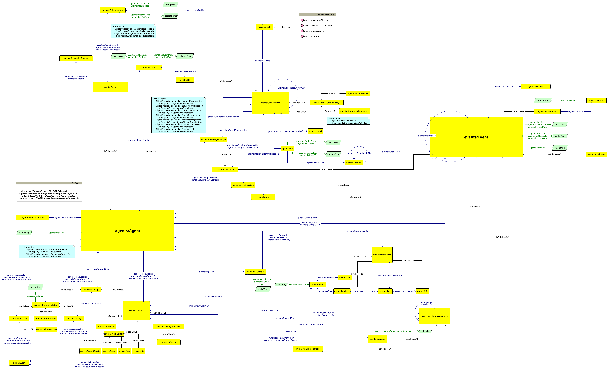

# Art Market Ontology

The following repository contains material concerning the Art Market Ontology. This model analyzes most relevant entities and properties in the art market starting from the data available in the Fondazione Zeri Photo Archive. 

This project is carried out by Manuele Veggi both as internship activity (January - March 2023, tutor: Prof Mambelli) and as Collegio Superiore final thesis (tutor: Prof Iannucci, co-tutor: Prof Peroni).

## Resources

Draft of the alignment available at the following [Google Document](https://docs.google.com/document/d/1a5xt6RPwbrgx-sX4Zi5iYsC8NPONPft-SpdreQEzJew/edit?usp=sharing)
