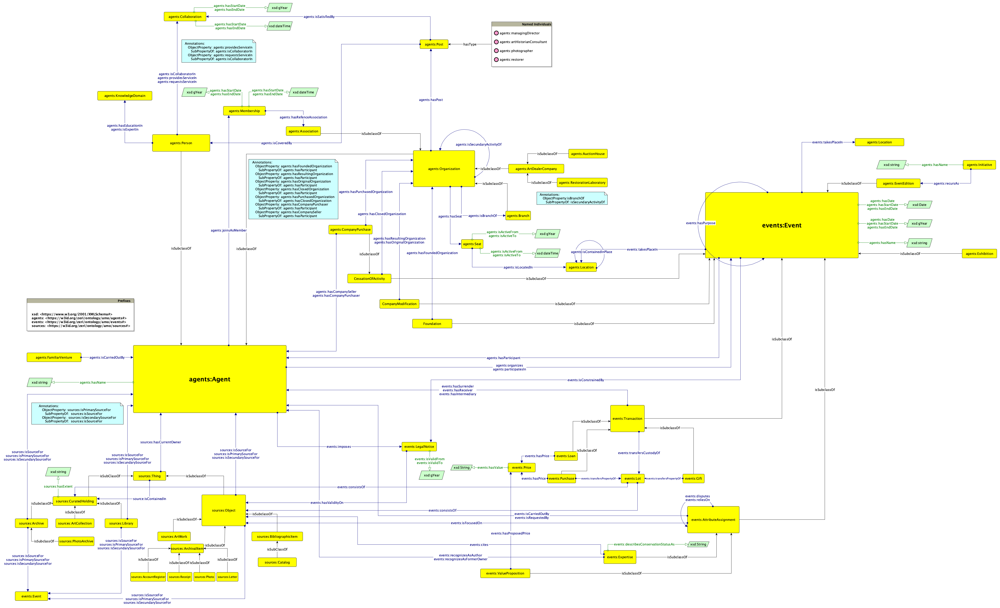

# Art Market Ontology

The following repository contains material concerning the Zeri Art Market Ontology (ZAMO, link to documentation soon available), an OWL 2 DL ontology analyzing most relevant entities and properties in the art market starting from the data available in the Fondazione Zeri Photo Archive. This project is carried out by Manuele Veggi and was firstly conceived as internship activity (January - March 2023, tutor: Prof Mambelli) at the Fondazione Zeri - Bologna and later completed as Collegio Superiore final thesis (tutor: Prof Iannucci, co-tutor: Prof Peroni).

ZAMO has been developed following [SAMOD](http://dx.doi.org/10.6084/m9.figshare.3189769), the Simplified Agile Methodology for Ontology Development.

This repository contains the full documentation produced during the development of the ontology. In particular:
- the ```samod``` directory contains the material produced during SAMOD iterations, i.e. Motivating Scenario, a set of examples use case, a list of Informal Competency Questions (in English), their translation into SPARQL, a Graffoo diagram of the model in .png format (along with its .graphml file), a TBox and a ABox. 
As it can be inferred by the hierarchy of its subfolders, the iterations were run separately on the three different modules; later, milestones were created by merging the populated modelets (TBox and ABox), on which the different test were performed, and by refractoring these knowledge graphs;
- the ```docs``` directory contains all the files related to the ontology and its versions in time;




## Resources and Publication

A preliminary analysis of the current ontology was published as Veggi, Manuele, and Francesca Mambelli. "Modelling The Art Market in The Semantic Web. A Preliminary Analysis." <i>Umanistica Digitale</i> 16 (2023): 141-166. 

Draft of the alignment available at the following [Google Document](https://docs.google.com/document/d/1a5xt6RPwbrgx-sX4Zi5iYsC8NPONPft-SpdreQEzJew/edit?usp=sharing)

## License

Shield: [![CC BY 4.0][cc-by-shield]][cc-by]

This work is licensed under a
[Creative Commons Attribution 4.0 International License][cc-by].

[![CC BY 4.0][cc-by-image]][cc-by]

[cc-by]: http://creativecommons.org/licenses/by/4.0/
[cc-by-image]: https://i.creativecommons.org/l/by/4.0/88x31.png
[cc-by-shield]: https://img.shields.io/badge/License-CC%20BY%204.0-lightgrey.svg
