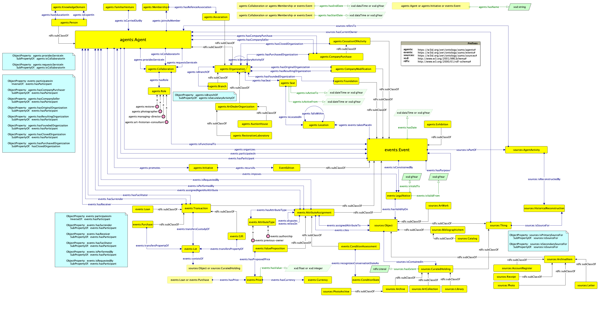

# Zeri Art Market Ontology

The following repository contains material concerning the Zeri Art Market Ontology (ZAMO, link to documentation soon available), an **OWL 2 DL ontology** analyzing most relevant **entities and properties in the art market** starting from the data available in the Fondazione Zeri Photo Archive. This project is carried out by Manuele Veggi and was firstly conceived as internship activity (January - March 2023, tutor: Prof Mambelli) at the [**Fondazione Zeri - Bologna**](https://fondazionezeri.unibo.it/it) and later completed as [Collegio Superiore](https://site.unibo.it/collegio-superiore/it) final thesis (tutor: Prof Iannucci, co-tutor: Prof Peroni).

ZAMO has been developed following [**SAMOD**](http://dx.doi.org/10.6084/m9.figshare.3189769), the **Simplified Agile Methodology for Ontology Development**.

This repository contains the full documentation produced during the development of the ontology. In particular:
- the ```docs``` directory contains all the files related to the ontology and its versions in time;
- the ```samod``` directory contains the material produced during SAMOD iterations. For the description and the organization of the material in the subfolder, please read the corresponding [note](samod/README.md).

Additional material produced in the conceptualization and the development of the ontology may be found in an *ad hoc* private [GitHub repository](https://github.com/fondazerimv/zamo-ancillary).

For any issue, you can write an email to manuele.veggi@uniroma1.it.



## Resources and Publication
The final thesis, containing a description of the ontology and of the adopted methodology, was released as arXiv working paper. Please, to refer to this project, cite this document: 
> Veggi, Manuele. "A First Ontological Model for the Description of the Art Market in the Semantic Web". <i>arXiv</i> (2024). [](https://arxiv.org/abs/2404.00395) 

A preliminary analysis of the current ontology was published as 
> Veggi, Manuele, and Francesca Mambelli. "Modelling the Art Market in the Semantic Web. A Preliminary Analysis." <i>Umanistica Digitale</i> 16 (2023): 141-166. 

## License

Shield: [![CC BY 4.0][cc-by-shield]][cc-by]

This work is licensed under a
[Creative Commons Attribution 4.0 International License][cc-by].

[![CC BY 4.0][cc-by-image]][cc-by]

[cc-by]: http://creativecommons.org/licenses/by/4.0/
[cc-by-image]: https://i.creativecommons.org/l/by/4.0/88x31.png
[cc-by-shield]: https://img.shields.io/badge/License-CC%20BY%204.0-lightgrey.svg
